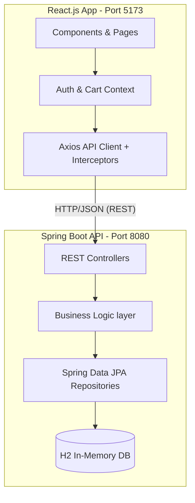

# Stride Store - Premium Athletic Footwear E-Commerce

A full-stack premium e-commerce web application built with **Spring Boot 3** and **React.js 18 (Vite)**. It features a modern, responsive UI with a dark athletic theme (inspired by Nike/Puma), complete with a functional shopping cart, product filtering, and authentication flow.

 
*(Note: Images used are high-quality placeholders from Unsplash)*

## 🚀 Features

### Frontend (React + Vite)
- **Modern UI/UX**: Premium dark theme with responsive glassmorphism and smooth CSS animations.
- **Product Discovery**: Dynamic product grid with filtering by category, text search, and sorting.
- **Shopping Cart**: Full add/remove/update quantity cart functionality powered by React `Context API`.
- **Checkout Flow**: Multi-step checkout simulation with order summary.
- **Authentication**: JWT-based user login and registration with route protection (`react-router-dom`).
- **Error Boundaries**: Elegant fallback UI for unhandled React crashes to maintain a premium feel.

### Backend (Spring Boot + Java 17)
- **RESTful API**: Clean, strictly-typed API architecture using DTO patterns.
- **Security**: Spring Security with stateless JWT (`io.jsonwebtoken`) authentication filters.
- **Database**: H2 In-Memory database for zero-config local development, automatically seeded via `CommandLineRunner`.
- **JPA / Hibernate**: Robust entity relationships (`Category` <-> `Product`, `User` <-> `Cart` <-> `CartItem`).
- **Data Validation & Error Handling**: `@RestControllerAdvice` for friendly JSON error responses.
- **CORS Support**: Pre-configured global CORS registry for seamless local frontend communication.

---

## 🏗 System Architecture

The project is divided into two separate applications that run concurrently:



---

## 💻 Tech Stack Setup & Installation

Ensure you have **Java 17** and **Node.js (v20+)** installed on your machine.

### 1. Backend (Spring Boot) Setup

1. Open a terminal and navigate to the backend directory:
   ```bash
   cd "backend"
   ```
2. Ensure your `JAVA_HOME` is pointing to Java 17. On Windows (PowerShell):
   ```powershell
   $env:JAVA_HOME = "C:\Program Files\Eclipse Adoptium\jdk-17.0.17.10-hotspot"
   ```
3. Run the Spring Boot application using the provided Maven wrapper:
   ```powershell
   & "$env:JAVA_HOME\bin\java.exe" -classpath ".mvn\wrapper\maven-wrapper.jar" "-Dmaven.multiModuleProjectDirectory=$PWD" org.apache.maven.wrapper.MavenWrapperMain spring-boot:run
   ```
   *The backend will start on `http://localhost:8080`. The database automatically seeds with 13 products and a demo user account.*

**H2 Database Console:** 
- URL: `http://localhost:8080/h2-console`
- JDBC URL: `jdbc:h2:mem:ecommercedb`
- User: `sa`
- Password: *(leave blank)*

### 2. Frontend (React) Setup

1. Open a new, separate terminal and navigate to the frontend directory:
   ```bash
   cd "frontend"
   ```
2. Install the Node modules:
   ```bash
   npm install
   ```
3. Start the Vite development server:
   ```bash
   npm run dev
   ```
   *The frontend will be available at `http://localhost:5173`.*

---

## 🧪 Testing the Application

Once both servers are running:
1. Open your browser to `http://localhost:5173`.
2. Browse products, filter by categories like "Running" or "Basketball".
3. Click on a product to view its details (sizes, colors, images).
4. **Log in** (Use the "Demo Account" button on the `/login` page: `admin@stridestore.com` / `admin123`).
5. Add items to your cart, go to checkout, and simulate a purchase.

---

## 🛠 Project Structure Deep-Dive

### Backend Structure (`/backend/src/main/java/com/ecommerce/backend`)
- `/config`: Security, CORS, and Database Seeding logic (`DataInitializer.java`).
- `/controller`: REST API endpoints (Products, Cart, Order, Auth, Categories).
- `/dto`: Data Transfer Objects to separate DB entities from API responses.
- `/exception`: Global exception handler for converting Java exceptions to 400/500 JSON payloads.
- `/model`: JPA Entities (`User`, `Product`, `Category`, `Cart`, `Order`).
- `/repository`: Spring Data JPA interfaces for database queries.
- `/security`: JWT Token Provider and `OncePerRequestFilter`.
- `/service`: Business logic handling mapping, carts, and order processing.

### Frontend Structure (`/frontend/src`)
- `/api`: Axios `api.js` client with JWT interceptors (handling 401/403 token expirations).
- `/components/layout`: Reusable structural UI (`Navbar`, `Footer`).
- `/components/ui`: Reusable design system UI (`ProductCard`, `ErrorBoundary`).
- `/context`: React Context providers for global state (`AuthContext.jsx`, `CartContext.jsx`).
- `/pages`: Full screen views (`HomePage`, `ProductsPage`, `ProductDetailPage`, `CheckoutPage`, etc.).
- `index.css`: The "source of truth" for the premium dark CSS design system (tokens, utility classes).

## ⚠️ Important Implementation Notes

- **JWT Expiration handling**: If the backend server restarts, the in-memory H2 DB is wiped. If your browser holds an old JWT token, the frontend Axios interceptor correctly catches the resulting `HTTP 403 Forbidden` error, clears your local storage, and prompts you to log in again.
- **Infinite Recursion Protection**: Spring Boot entities with bidirectional `@OneToMany` relations (like Category & Product) utilize `@JsonIgnoreProperties` to prevent infinite recursion during API JSON serialization.
